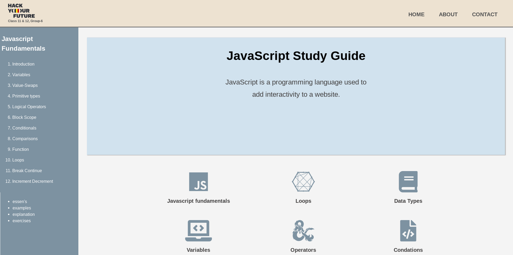

# JavaScript Study Guide

## Table of contents

- [General info](#general-info)
- [Group members](#Group_members)
- [Coach](#coach)
- [Technologies](#technologies)
- [Screenshots](#Screenshots)
- [Status](#status)
- [Contributions](#contributions)
- [Launch](https://rago89.github.io/Group-6-Study-Guide/)

## General info

This is an interactive JavasCript study guide web to help student developers on their journey into the wonderful world of code.

## Group 6 members

- [Rafael](https://github.com/rago89)
- [Tahmina](https://github.com/tahminarasoli)
- [Brain](https://github.com/Brainketunze)

## Coach

- [Stéphane](https://about.me/snicoll)

## Technologies

Project is created with:

- HTML5
- CSS

## Screenshots

## Status

Project is: in progress...

## Contributions

All contributions are welcome.
